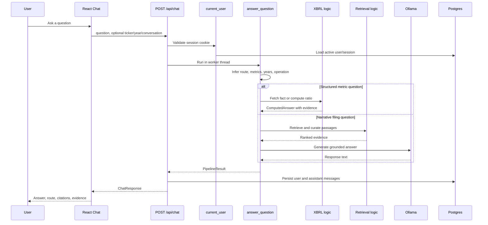
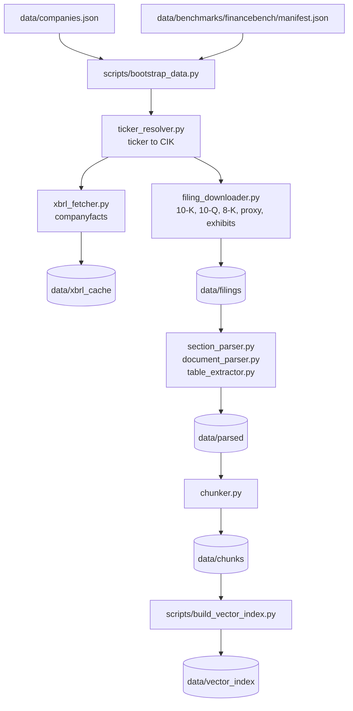
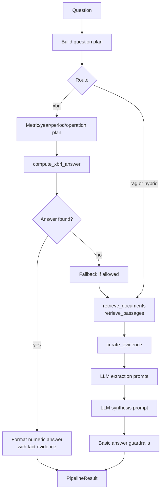
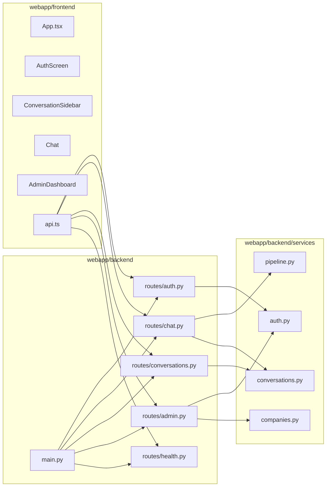
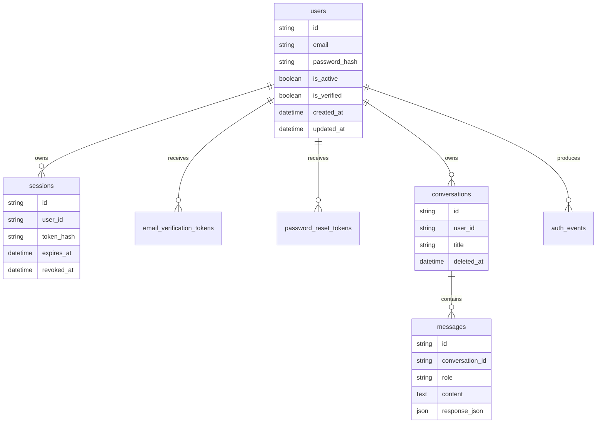
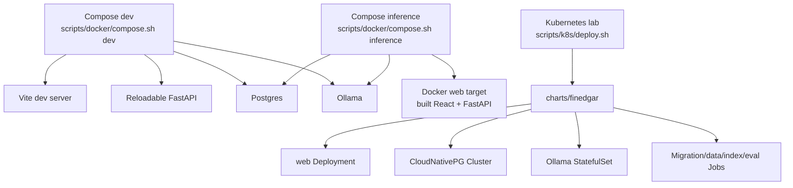
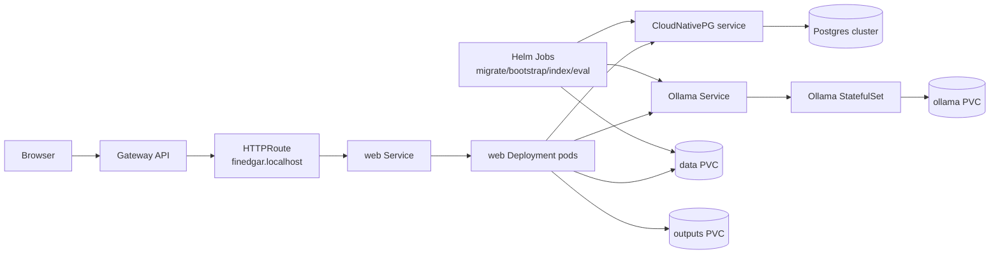
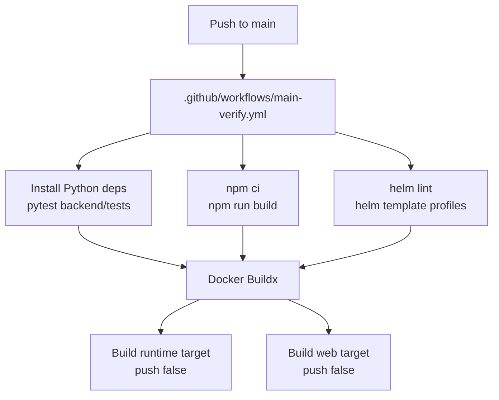

# Architecture

FinEdgar is a local-first SEC filing question-answering system. The app keeps
filing data, indexes, chat history, auth state, and model serving under the
operator's control. Cloud services are not required for the default workflow.

The codebase has four main layers:

- `backend/data`: filing ingestion, XBRL lookup, retrieval, scoring, and answer
  orchestration.
- `webapp/backend`: FastAPI routes, auth, sessions, chat persistence, health,
  metrics, and admin APIs.
- `webapp/frontend`: React interface for auth, company selection, chat,
  conversation history, and admin status.
- `docker`, `charts`, and `scripts`: local runtime, jobs, image builds, and the
  optional Kubernetes lab.

## System View

```mermaid
flowchart LR
    Browser[Browser] --> React[React app<br/>webapp/frontend]
    React --> API[FastAPI<br/>webapp/backend]

    API --> Auth[(Postgres<br/>users, sessions,<br/>chat history)]
    API --> Pipeline[Answer pipeline<br/>backend/data/answer_pipeline.py]
    API --> Admin[Admin overview<br/>/api/admin/overview]
    API --> Metrics[/metrics]

    Pipeline --> Planner[Question planning<br/>benchmarking.py]
    Planner --> XBRL[XBRL route<br/>xbrl_fetcher.py<br/>xbrl_reasoning.py]
    Planner --> RAG[RAG route<br/>retrieval.py<br/>embeddings.py<br/>reranker.py]

    XBRL --> XBRLCache[(data/xbrl_cache)]
    RAG --> Chunks[(data/chunks)]
    RAG --> VectorIndex[(data/vector_index)]
    RAG --> Ollama[Ollama<br/>local model server]

    Admin --> DataFiles[(data artifacts)]
    Admin --> Auth
```

## Chat Request Flow

The chat path starts in React, crosses FastAPI once, then runs the synchronous
answer pipeline in a worker thread so the event loop stays available for other
requests.



## Data Pipeline

The data pipeline produces the artifacts consumed by both the CLI evaluation
scripts and the web app. SEC HTTP calls are rate-limited and require a clear
`SEC_USER_AGENT`.



## Answering Strategy

FinEdgar deliberately separates deterministic financial calculations from
narrative synthesis:

- XBRL lookups and ratios use SEC companyfacts and explicit formulas.
- RAG answers use filing chunks, section hints, retrieval scoring, optional
  reranking, and an Ollama generation step.
- Hybrid behavior lets a structured answer fall back to RAG when a filing fact
  is unavailable or when the question is narrative by nature.



## Web Application Boundaries



## Persistence Model



## Runtime Modes



## Kubernetes Workload View



## CI Verification

The GitHub Actions workflow is intentionally verification-only. It runs after a
push to `main` and never pushes images or deploys.



## Operational Boundaries

- The default app is local-first. Do not assume public TLS, SMTP, or cloud
  storage unless those are explicitly configured.
- `data/` artifacts are part of the runtime contract. If they are missing, RAG
  quality and company coverage drop even when the API itself is healthy.
- Ollama is a separate dependency. `/healthz` reports whether it is reachable,
  but the app can still start while model serving is down.
- Postgres is required for authenticated web usage. The data pipeline remains
  file-based.
- GPU support is optional. The CPU path is the default for local demos and CI.
