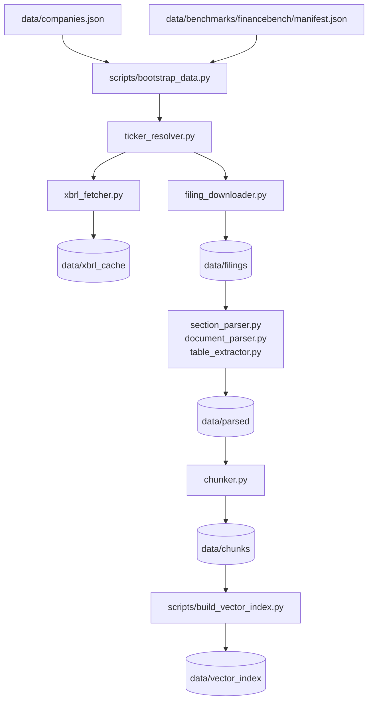

# Data Pipeline

The data pipeline turns SEC company metadata and filings into the local artifacts
used by XBRL lookup, retrieval, evaluation, and the web app.

## Inputs

| Input | Purpose |
|---|---|
| `data/companies.json` | Company universe shown in the web app and used by bootstrap jobs. |
| `data/company_overrides.json` | Manual ticker/CIK fixes for historical or missing SEC ticker cases. |
| `data/company_tickers.json` | Cached SEC ticker table. |
| `data/benchmarks/financebench/manifest.json` | Benchmark-driven company/year coverage hints. |
| `.env` / environment | `SEC_USER_AGENT`, Ollama settings, cache paths, auth/db values for web use. |

## Outputs

| Output | Written by | Used by |
|---|---|---|
| `data/xbrl_cache/` | `xbrl_fetcher.py` | XBRL route, admin dashboard, tests, evaluation. |
| `data/filings/` | `filing_downloader.py` | Parsers and audit scripts. |
| `data/parsed/` | `section_parser.py`, `document_parser.py` | Chunk builder and manual inspection. |
| `data/chunks/` | `chunker.py` | Retrieval, vector indexing, evaluation. |
| `data/vector_index/` | `build_vector_index.py`, `embeddings.py` | Dense retrieval. |

## Pipeline Diagram



## Main Commands

Build the default corpus:

```bash
python scripts/bootstrap_data.py
python scripts/build_vector_index.py
```

Run a smaller smoke pass:

```bash
python scripts/bootstrap_data.py --limit 3
python scripts/build_vector_index.py
```

Run through Docker:

```bash
scripts/docker/compose.sh data bootstrap -- --limit 3
scripts/docker/compose.sh data index
```

Run inside Kubernetes as Helm jobs:

```bash
scripts/k8s/run-job.sh data-bootstrap
scripts/k8s/run-job.sh index-builder
```

## Module Responsibilities

- `ticker_resolver.py` resolves tickers to SEC CIKs using cache, SEC data, and
  local overrides.
- `xbrl_fetcher.py` fetches companyfacts, caches them, and selects the best fact
  for a metric/year/period.
- `filing_downloader.py` finds supported SEC filings and stores raw documents.
- `section_parser.py` extracts 10-K sections such as Item 1, Item 1A, Item 7,
  Item 7A, and Item 8.
- `document_parser.py` handles generic HTML/PDF text extraction.
- `table_extractor.py` converts HTML filing tables into readable Markdown.
- `chunker.py` creates token-bounded chunks with ticker, year, section, and
  document metadata.
- `embeddings.py` builds and loads FAISS-backed dense indexes.
- `retrieval.py` performs metadata filtering, section scoring, lexical ranking,
  neighbor expansion, reranking hooks, and evidence curation.

## Operational Notes

- SEC calls require a descriptive `SEC_USER_AGENT`.
- Bootstrap can take a long time for broad company/year coverage because SEC
  access is rate-limited and filings are large.
- The web app can start without a warm corpus, but RAG quality depends on
  `data/chunks/` and `data/vector_index/`.
- XBRL answers can still work when narrative filing chunks are incomplete, as
  long as `data/xbrl_cache/` has the needed companyfacts.
- Keep benchmark artifacts separate from generated training data. The leakage
  checker exists to prevent eval-only tuples from entering train records.

## Validation

Run the focused data tests:

```bash
python -m pytest backend/tests/test_data_pipeline.py -v
python -m pytest backend/tests/test_benchmark_safety.py -v
```

Useful audit commands:

```bash
python scripts/audit_coverage.py
python scripts/check_benchmark_leakage.py
```
