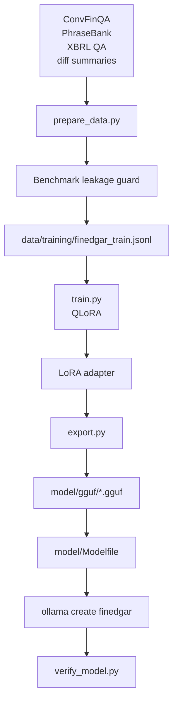

# Model Fine-Tuning

Fine-tuning is optional. The application can run with any compatible Ollama
model, including the small demo model used by the Kubernetes local lab. The
training path exists for improving FinEdgar-specific financial QA behavior.

## Training Flow



## Main Files

| File | Purpose |
|---|---|
| `model/training/prepare_data.py` | Builds, combines, and validates training records. |
| `model/training/bootstrap_diffs.py` | Drafts filing-diff examples with a local teacher model. |
| `model/training/train.py` | Runs QLoRA fine-tuning. |
| `model/training/export.py` | Exports/merges model artifacts and writes the Ollama Modelfile. |
| `model/training/verify_model.py` | Sends smoke prompts to the registered Ollama model. |
| `model/configs/qlora_e4b.yaml` | Active training config. The filename is historical; check `model.name`. |
| `requirements-train.txt` | Training-only dependencies. |
| `docker/Dockerfile.train` | CUDA training image. |
| `docker/compose/train.nvidia.yml` | Compose jobs for NVIDIA training hosts. |

## Local Commands

Prepare and validate data:

```bash
python model/training/prepare_data.py --sources convfinqa,phrasebank,xbrl_qa,diff_summaries
python model/training/prepare_data.py --combine
python model/training/prepare_data.py --validate data/training/finedgar_train.jsonl
```

Train and export:

```bash
python model/training/train.py --config model/configs/qlora_e4b.yaml
python model/training/export.py
```

Register with Ollama:

```bash
cd model
ollama create finedgar -f Modelfile
cd ..
python model/training/verify_model.py --model finedgar
```

## Docker Training Path

Training through Compose is only for Linux NVIDIA/CUDA hosts:

```bash
scripts/docker/compose.sh train check
scripts/docker/compose.sh train prepare
scripts/docker/compose.sh train run
scripts/docker/compose.sh train export
scripts/docker/compose.sh train verify
```

The wrapper refuses to run training when it detects a CPU-only target.

## Data Hygiene

- Keep evaluation-only FinanceBench tuples out of train records.
- Run `scripts/check_benchmark_leakage.py` after dataset changes.
- Review generated diff-summary examples before including them in a combined
  training file.
- Store large model outputs outside Git unless the project explicitly decides to
  version a small artifact.

## Verification

Model quality is measured through evaluation, not through loss alone:

```bash
python scripts/run_financebench_eval.py \
  --output outputs/eval_runs/eval_$(date +%Y%m%d_%H%M%S).json
python scripts/summarize_evals.py
```

Track route-level behavior. A model change can improve narrative answers while
hurting structured XBRL formatting, or the reverse.
