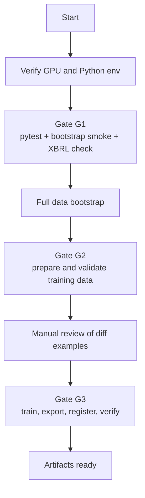

# Orchestrator

`scripts/orchestrate.sh` is an older end-to-end runner for a single local
machine. It is useful as a reference for the intended gates, but it is not the
recommended everyday entry point.

Use the smaller documented commands in [Docker Workflows](docker.md), [Data
Pipeline](data_pipeline.md), and [Model Fine-Tuning](model_finetuning.md) unless
you specifically want the full long-running sequence.

## What It Does



## Current Caveats

- The script still assumes a local path through `PROJECT_ROOT`.
- It assumes a specific Python environment through `PY`.
- It expects CUDA availability before continuing.
- It includes a manual review pause.
- It can take hours because full bootstrap, training, export, and verification
  are all chained together.

## Safer Alternatives

Run the fast regression checks:

```bash
python -m pytest backend/tests/ -v
```

Run a small data smoke pass:

```bash
python scripts/bootstrap_data.py --limit 3
python scripts/build_vector_index.py
```

Run a focused eval:

```bash
python scripts/run_financebench_eval.py --limit 5
```

Use Docker for repeatable local services:

```bash
scripts/docker/compose.sh dev up
scripts/docker/compose.sh data bootstrap -- --limit 3
scripts/docker/compose.sh data index
scripts/docker/compose.sh eval run -- --limit 5
```

## When To Revisit It

If the project needs a single-command release train later, rebuild this script
around parameterized phases:

- `--skip-train`
- `--skip-bootstrap`
- `--limit`
- `--config`
- `--output`
- `--non-interactive`
- explicit CPU/GPU target selection

At that point it should also share behavior with the GitHub Actions verification
workflow instead of duplicating separate checks.
